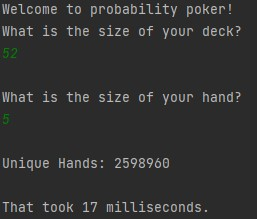

# Unique Poker Hands

For this application, two numbers a given as input. The size of the deck and the size of the hand. With these two numbers, an output is given which is the number of unique hands possible. The calculation is essentially a binomial coefficient but a constraint has been added where only 8 bytes can be used to represent an integer. This makes the processing more complex where large integers have to be represented as integer arrays where basic arithmetic is done between them.

## How to Run

`javac ProbabilityPoker.java`

`java ProbabilityPoker`

## Example

